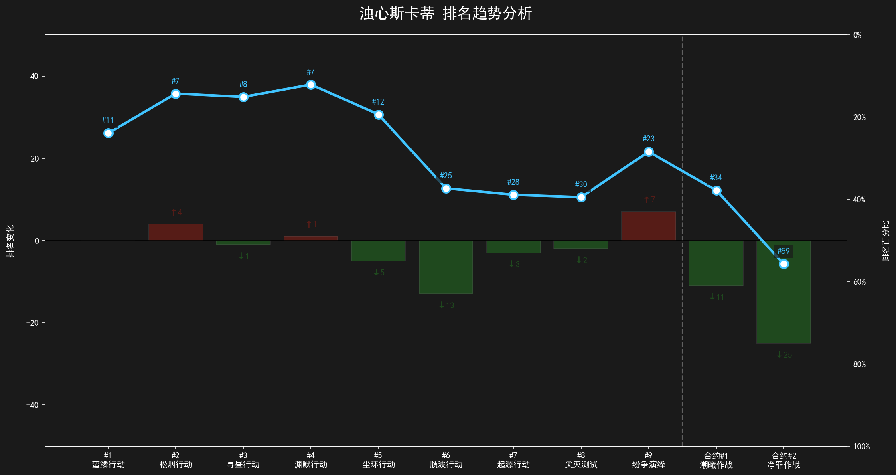

# 明日方舟血狼破军合约排行榜干员分析

<center>
[](https://www.python.org/)
[](LICENSE)
</center>

由知名攻略作者血狼破军提供的明日方舟合约作战干员排名数据分析与可视化系统，自动生成适合视频制作的动态排名趋势图表。



## 功能特性

✅ **智能数据解析**  
- 支持多赛季历史排名数据（Excel格式）
- 自动处理干员登场时间线

🎨 **视频友好可视化**  
- 暗色系主题（黑底白字+青蓝主色）
- 动态箭头标注排名变化（↑进步 ↓退步）
- 三重参考线（超大杯-大杯-中杯）

📊 **双维度分析**  
- 绝对排名数值（折线节点显示 #排名）
- 相对排名百分比（0%=榜首，100%=榜尾）
- 赛季阶段分隔线（标记特殊赛季）

## 数据格式

原始数据示例（`/hist.xlsx`）：
```csv
名次	"#1(蛮鳞行动)
2021-09-28"	"#2(松烟行动)
2021-12-09"	"#3(寻昼行动)
2022-03-11"
1	史尔特尔	史尔特尔	史尔特尔
2	假日威龙陈	假日威龙陈	假日威龙陈
3	银灰	风笛	风笛
4	风笛	银灰	铃兰
5	泥岩	铃兰	银灰
6	铃兰	泥岩	泥岩
7	艾雅法拉	浊心斯卡蒂	夜莺
8	塞雷娅	琴柳	浊心斯卡蒂
9	凯尔希	夜莺	琴柳
10	琴柳	凯尔希	令
```